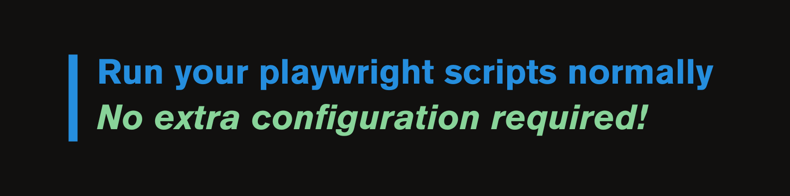

<div align="center" style="text-align: center --force;">
  <h1 align="center" style="text-align: center --force; margin-bottom: 10px;"><a href='https://playwright.dev'>🎭X</a>Driver</h1>

  <a href="https://pypi.org/">
    
  </a>
  <a href="https://www.python.org/">
    
  </a>
  <a href="https://playwright.dev/python/">
    
  </a>
  <a href="https://github.com/PyCQA/isort">
        
    </a>
    <a href="https://github.com/ambv/black">
        
    </a>
</div>

<div align="center" style="text-align: center --force;">
<h4 align="center" style="margin-top: 10px; margin-bottom: 10px;">Scrape the Web Without Getting Blocked – Playwright Anti-Block Patch Tool ❤️</h4>
<p style="margin-top: px;"><b>XDriver</b> patches Playwright with a single command to bypass anti-bot systems and make your scraping sessions block-free. It modifies driver, CDP connections and python wrapper, helping you avoid detection.</p>
</div>


## Getting Started

### Installation

You can install **XDriver** using `pip`:

```shell
$ pip install x_driver
```

### Activate XDriver

To patch your Playwright installation for stealth scraping, run:

```shell
$ x_driver activate
```

This command modifies Playwright’s source code to bypass common bot detection systems, making your scraping scripts more undetectable.

---

### Running playwright

<div align="center" style="text-align: center --force;">

</div>

Once XDriver is activated, you can **run your Playwright scripts just like you normally would**—no additional changes needed.

Here's a basic example:

```python
import asyncio
import re
from playwright.async_api import Playwright, async_playwright, expect

async def run(playwright: Playwright) -> None:
    browser = await playwright.chromium.launch(headless=False)
    context = await browser.new_context()
    page = await context.new_page()
    await page.goto("http://example.com/")

    await context.close()
    await browser.close()

async def main() -> None:
    async with async_playwright() as playwright:
        await run(playwright)

asyncio.run(main())
```

XDriver ensures your Playwright instance is patched for stealth, allowing you to scrape without getting blocked

---

### Deactivate XDriver

To restore Playwright to its original state, run:

```shell
$ x_driver deactivate
```

This safely reverts all changes made by XDriver, returning Playwright to its default configuration.

---

<div align="center">
    <h4>💬 Let's Connect</h4>
  <a href="https://www.linkedin.com/in/arjunshankar1/" target="_blank">
    
  </a>
  <a href="mailto:arjun.sha2425@gmail.com" target="_blank">
    
  </a>
  <a href="https://www.linkedin.com/in/arjunshankar1/">
    <br>
  </a>
</div>